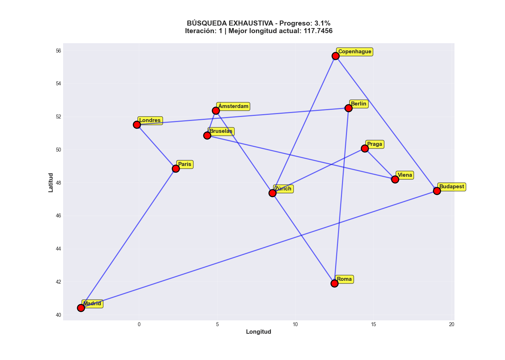
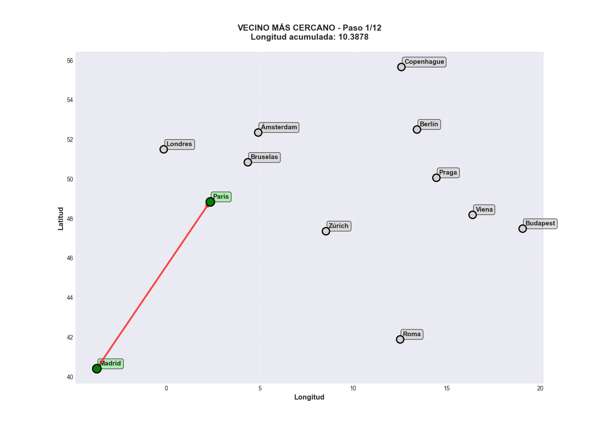

# Evaluación 2: Problema del Viajante (TSP)

Este proyecto implementa y compara dos enfoques distintos para resolver el clásico **Problema del Viajante (Traveling Salesperson Problem - TSP)**: una búsqueda exhaustiva que garantiza la solución óptima y una heurística constructiva (Vecino Más Cercano) que busca una solución aproximada de manera eficiente.

## 📋 Descripción del Proyecto

El objetivo es encontrar la ruta más corta posible que visite un conjunto de ciudades europeas exactamente una vez y regrese a la ciudad de origen. El proyecto analiza el compromiso entre la calidad de la solución (longitud del ciclo) y el tiempo de cómputo requerido.

### Estructura del Proyecto

```
INFO1158___Evaluaci-n_2/
├── INFO1158___Evaluación_2.pdf # Enunciado de la evaluación
├── main.py                     # Script principal que orquesta la ejecución
├── README.md                   # Documentación del proyecto
├── results/                    # Carpeta generada con gráficos, tablas y animaciones
└── src/                        # Código fuente modular
    ├── comparador.py           # Análisis comparativo y generación de métricas
    ├── distance_calculator.py  # Cálculo de matrices de distancia (Euclidiana)
    ├── exhaustive_search.py    # Algoritmo de Búsqueda Exhaustiva
    ├── nearest_neighbor.py     # Algoritmo del Vecino Más Cercano
    └── visualizer.py           # Generación de gráficos y animaciones
```

## 🧠 Algoritmos de Búsqueda

El núcleo del proyecto reside en la comparación de estos dos algoritmos:

### 1. Búsqueda Exhaustiva (Solución Óptima)
Este algoritmo explora **todas las posibles permutaciones** de las ciudades para encontrar el ciclo Hamiltoniano de longitud mínima.

*   **Lógica**:
    1.  Fija la ciudad de inicio (para evitar ciclos equivalentes por rotación).
    2.  Genera todas las permutaciones posibles de las ciudades restantes.
    3.  Para cada permutación, construye el ciclo completo y calcula su distancia total.
    4.  Mantiene registro de la mejor solución encontrada hasta el momento.
*   **Complejidad**: Factorial $O((n-1)! / 2)$. Se vuelve computacionalmente intratable muy rápidamente a medida que aumenta el número de ciudades ($n$).
*   **Garantía**: Siempre encuentra la solución óptima global ($L^\star$).

### 2. Heurística del Vecino Más Cercano (Solución Aproximada)
Un algoritmo voraz (*greedy*) que construye una solución paso a paso, tomando siempre la decisión que parece mejor en ese instante local.

*   **Lógica**:
    1.  Comienza en una ciudad inicial aleatoria o predefinida.
    2.  Desde la ciudad actual, busca la ciudad **no visitada** más cercana.
    3.  Se desplaza a esa ciudad y la marca como visitada.
    4.  Repite el proceso hasta visitar todas las ciudades.
    5.  Finalmente, regresa a la ciudad de origen para cerrar el ciclo.
*   **Complejidad**: Polinomial $O(n^2)$. Es extremadamente rápido incluso para miles de ciudades.
*   **Garantía**: No garantiza la solución óptima. La solución encontrada ($L_{NN}$) suele ser razonablemente buena, pero puede caer en óptimos locales.

## 🔄 Flujo de Ejecución

El archivo `main.py` ejecuta el siguiente flujo de trabajo:

1.  **Inicialización**: Define las coordenadas de las ciudades (Madrid, París, Londres, etc.).
2.  **Cálculo de Distancias**: Genera la matriz de distancias $D$ utilizando la distancia Euclidiana.
3.  **Ejecución de Algoritmos**:
    *   Ejecuta la Búsqueda Exhaustiva y mide tiempo/longitud.
    *   Ejecuta el Vecino Más Cercano y mide tiempo/longitud.
4.  **Análisis Comparativo**:
    *   Calcula el **Gap de Optimalidad**: $\% Gap = \frac{L_{NN} - L^\star}{L^\star} \times 100$
    *   Calcula el **Speedup**: Cuántas veces más rápido es el algoritmo heurístico.
5.  **Visualización**:
    *   Genera gráficos estáticos de los ciclos encontrados.
    *   Crea gráficos de barras comparando tiempos y distancias.
    *   (Opcional) Genera animaciones GIF mostrando el proceso de búsqueda paso a paso.

## 📊 Resultados Visuales

El programa genera animaciones que permiten visualizar cómo opera cada algoritmo:

### Búsqueda Exhaustiva
Explora todas las posibilidades (líneas rojas) hasta encontrar el óptimo (línea verde).


### Vecino Más Cercano
Construye la ruta paso a paso eligiendo siempre la ciudad más próxima.


## 🛠️ Requisitos e Instalación

El proyecto requiere Python 3 y las siguientes librerías externas:

*   `matplotlib`: Para la generación de gráficos y animaciones.
*   `pandas`: Para estructurar los resultados en tablas.
*   `numpy`: Para cálculos numéricos eficientes.
*   `pillow`: Para guardar las animaciones en formato GIF.

Puedes instalar las dependencias con:

```bash
pip install matplotlib pandas numpy pillow
```

## 🚀 Uso

Para ejecutar el análisis completo, corre el script principal desde la raíz del proyecto:

```bash
python main.py
```

Los resultados se guardarán automáticamente en la carpeta `results/`.
